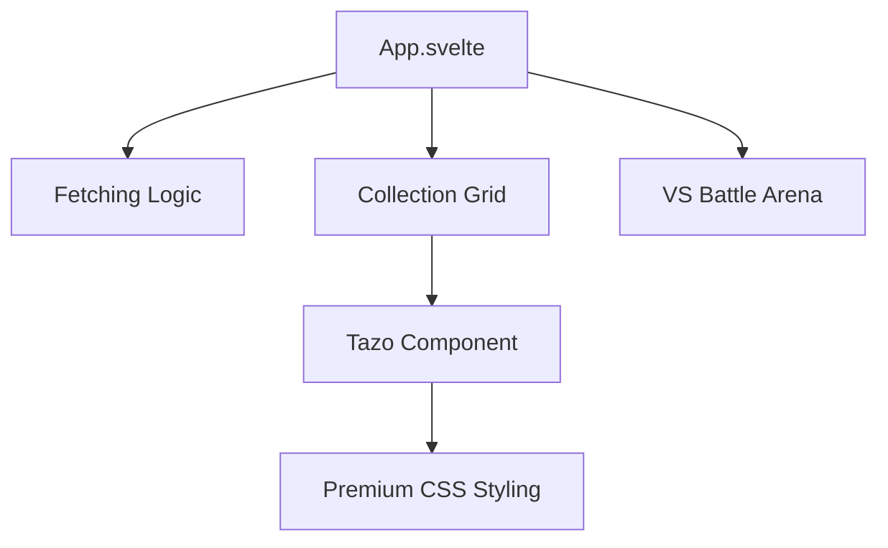

# Yu-Gi-Oh! Tazos VS - Reporte de Viabilidad

¡Es totalmente posible! He creado un prototipo funcional para demostrar cómo Svelte puede manejar estas APIs y convertirlas en una experiencia de "tazos" premium.

## 🚀 Análisis Técnico

### 1. Consumo de APIs
Las APIs proporcionadas (`skill.json` y `rush.json`) son ideales porque:
- Devuelven arrays de objetos limpios.
- Incluyen `konami_id`, lo que nos permite obtener imágenes de alta resolución de fuentes como `ygoprodeck`.
- Svelte maneja la reactividad de estos datos de forma nativa con `fetch` en el `onMount`.

### 2. Diseño de los "Tazos"
Para lograr el efecto visual de tazos, hemos implementado:
- **CSS Shapes:** Contenedores circulares con bordes metálicos y sombras internas.
- **Glassmorphism:** Fondos translúcidos con desenfoque para un toque moderno.
- **Micro-animaciones:** Efectos de "hover" que simulan el movimiento físico de un tazo al tocarlo.

### 3. Lógica del "VS"
La aplicación permite:
- Seleccionar dos personajes de una colección dinámica.
- Comparar sus estadísticas (ATK/DEF) en un "Battle Ring".
- Reiniciar el duelo fácilmente.

## 🛠️ Estructura del Proyecto

## 📸 Demostración de Diseño

Hemos aplicado una paleta de colores oscura con acentos en violeta y ámbar, inspirada en el aura de los juegos de cartas clásicos pero con un acabado moderno de alta gama.

> [!TIP]
> Para las imágenes de las cartas de habilidad (Skill Cards), como no tienen un ID de Konami estándar, podemos usar un generador de placeholders o buscar por nombre en la base de datos de Yugipedia.

---

### ¿Cómo continuar?
Ya tienes el entorno configurado y los componentes base creados. Puedes expandir esto agregando:
- Efectos de sonido al seleccionar un tazo.
- Animaciones de "volteo" (flipping) al iniciar el duelo.
- Un sistema de puntuación basado en los atributos de las cartas.
